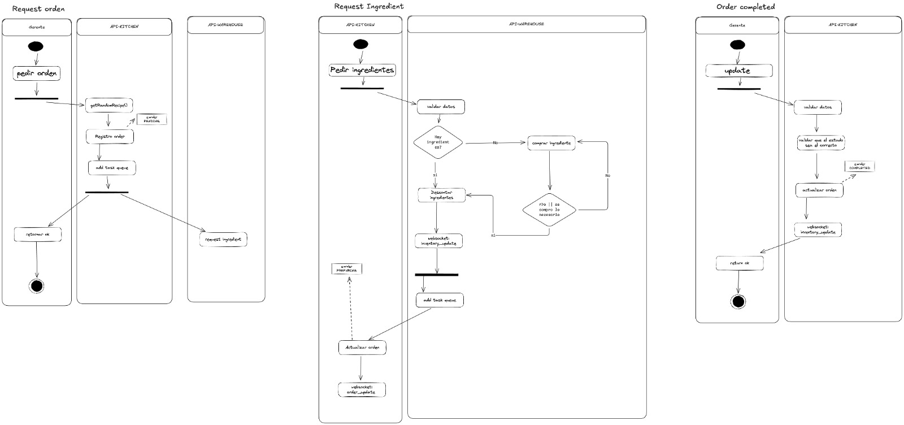

# 🍽️ Sistema de Restaurante - Monorepo

Este es un monorepo para la gestión de un restaurante, compuesto por:

- **Frontend** (Vite + React)
- **Microservicio API-Kitchen** (Express)
- **Microservicio API-Warehouse** (Express)

## 📂 Estructura del Proyecto
```
tech-test-alegra/
│── database/
│   ├── init.sql          # Automatic sql
│── service/
│   ├── api-kitchen/      # Microservicio de cocina (Express)
│   ├── api-warehouse/    # Microservicio de almacén (Express)
│── frontend/             # Interfaz web del sistema (Vite + React)
│   ├── nginx.conf        # Configuración de Nginx (proxy)
│── docker-compose.yml    # Configuración de contenedores
```
## 📌  Tecnologias usadas 
### Frontend
- Vite
- React
- JavaScript/TypeScript
- TailwindCSS 
### Backend (Microservicios)
- Express (Node.js framework)
- PostgreSQL (Base de datos)
- Redis (Cola de tareas y caché)
- TypeORM (si aplica)
### Infraestructura y Despliegue
- Docker & Docker Compose
- Nginx (Proxy inverso)
- AWS EC2 (Hosting)

## 📡 Comunicación y Transporte

El sistema utiliza dos protocolos principales para la comunicación entre el frontend y los microservicios:

- HTTP: Para la mayoría de las operaciones RESTful, como la gestión de órdenes e inventario.

- WebSocket: Utilizado en API-Kitchen para actualizaciones en tiempo real del estado de las órdenes.

Ademas de eso usa un sistema de colas para mantener la integridad de los datos con Bullmq

## Caso de uso principales




## 🚀 Instalación y Ejecución

### 1️⃣ Prerrequisitos

- Node.js 18+

- Docker & Docker Compose


### 2️⃣ Instalación

Clona el repositorio y entra en la carpeta del proyecto:
```
 git clone https://github.com/SergioOteroxD/tech-test-alegra.git
 cd tech-test-alegra
 ```


### 3️⃣ Levantar el sistema con Docker
```

 docker-compose up --build -d
 ```

Esto iniciará:

- Nginx en el puerto 80

- Frontend en http://localhost:8080

 - API-Kitchen en http://localhost:3001

- API-Warehouse en http://localhost:3002

Si quieres correrlo sin Docker:
 ```
 cd tech-test-alegra/service/api-kitchen && npm install && npm run start:dev
 cd tech-test-alegra/service/api-warehouse && npm install &&  npm run start:dev
 cd tech-test-alegra/frontend && npm install &&  npm run dev
  ```
